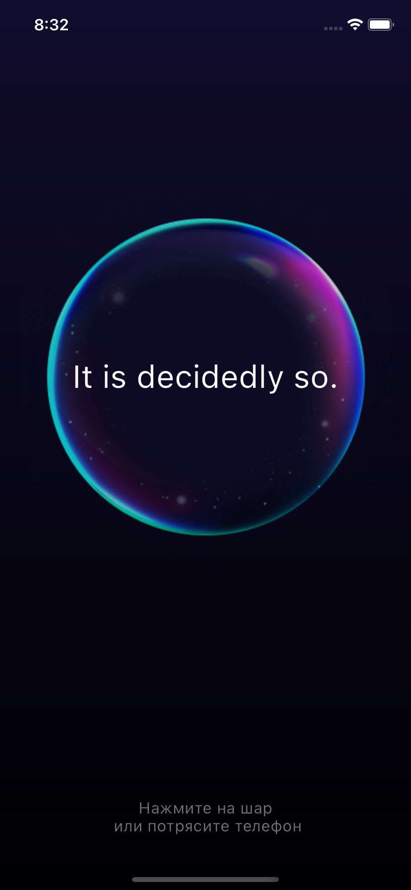
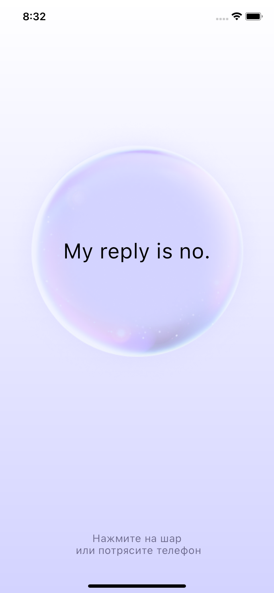
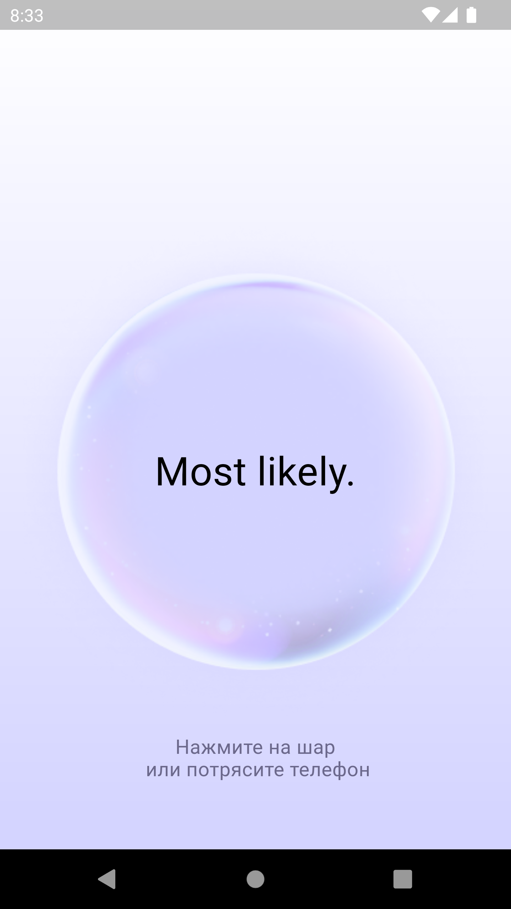

# Добрый день! Меня зовут Александра и я работаю Flutter - разработчиком чуть больше года.

# Сегодня хочу представить Вам свою реализацию задания по приложению "Шар предсказания"

## Приложение для получения предсказаний

### IOS

#### Темная тема

#### Светлая тема

### Android

#### Темная тема

#### Светлая тема

## За основу взята чистая архитектура и в качестве State Management - Flutter_BLoC

Первый проект в компании у меня написан на Redux и сейчас мы начали второй на Flutter BLoC,
поэтому я выбрала его, чтобы продолжить разбираться в нем.

## Что удалось сделать за указанные сроки?

1. Организовать структуру проекта
2. Начать настройку темы в зависимости от системного оформления
3. Настроить маршруты
4. Подготовить необходимые ресурсы (картинки) для реализации шара
5. Изменить базовое название приложения
6. Настроить базово экран для отображения предсказания в зависимости от устройства
7. Реализовать сервис для отправки запроса
8. Обработать данные после запроса с выводом их на экран

## Что предстоит сделать?

1. Закончить работу над экраном с предсказаниями
2. Добавить анимации
3. Добавить возможность получать предсказание при тряске экрана
4. Адаптировать приложение под WEB
5. Реализовать экран с настройками
6. Проверить приложение на всех типах устройств

P.S. В первый раз участвую в Study Jam. Спасибо Вам за доклады и за интересное задание! =)